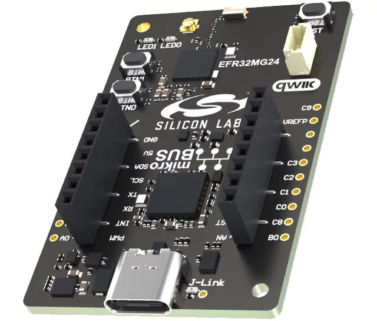
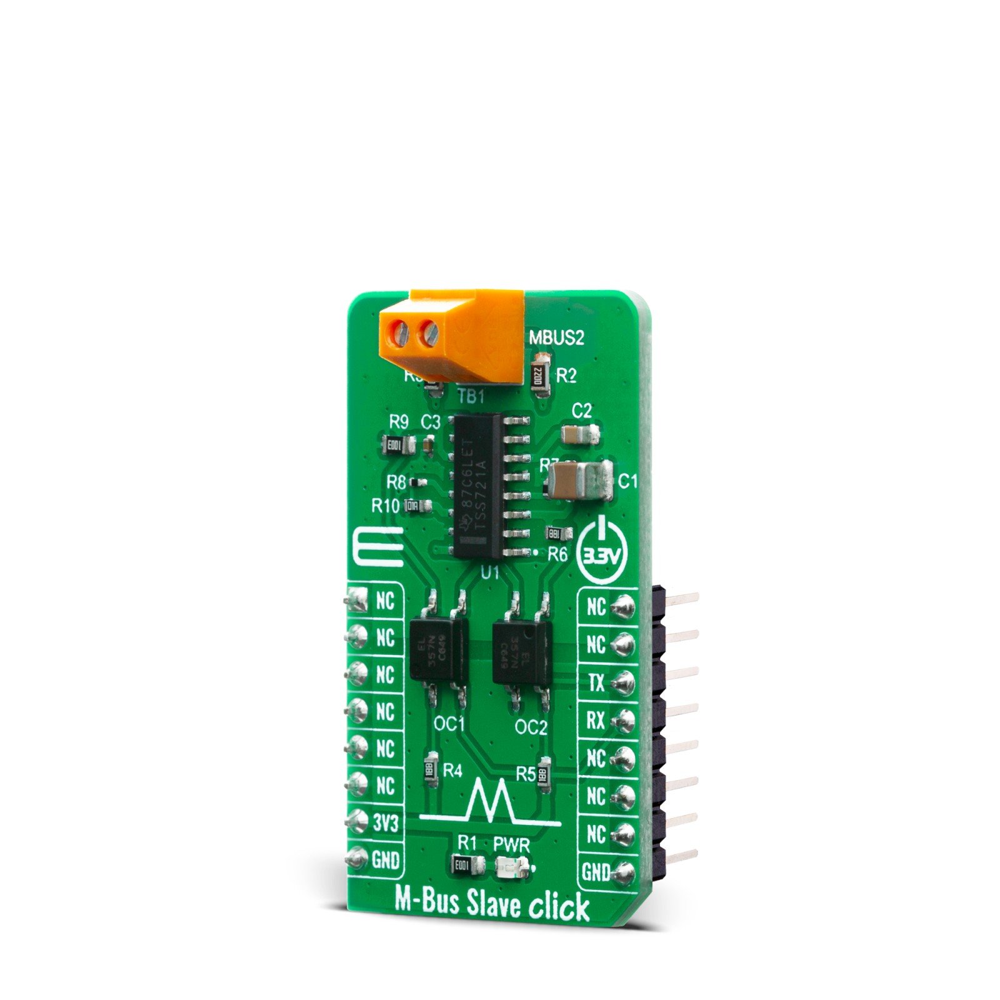
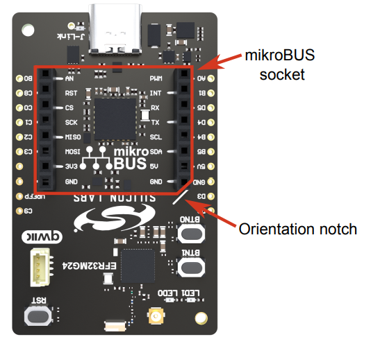
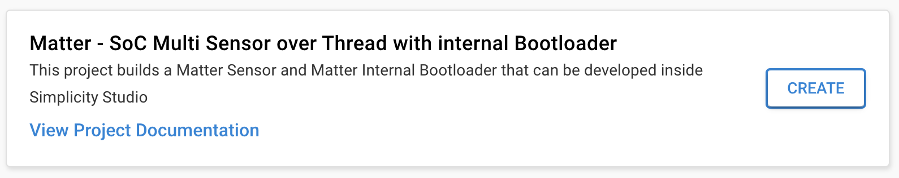
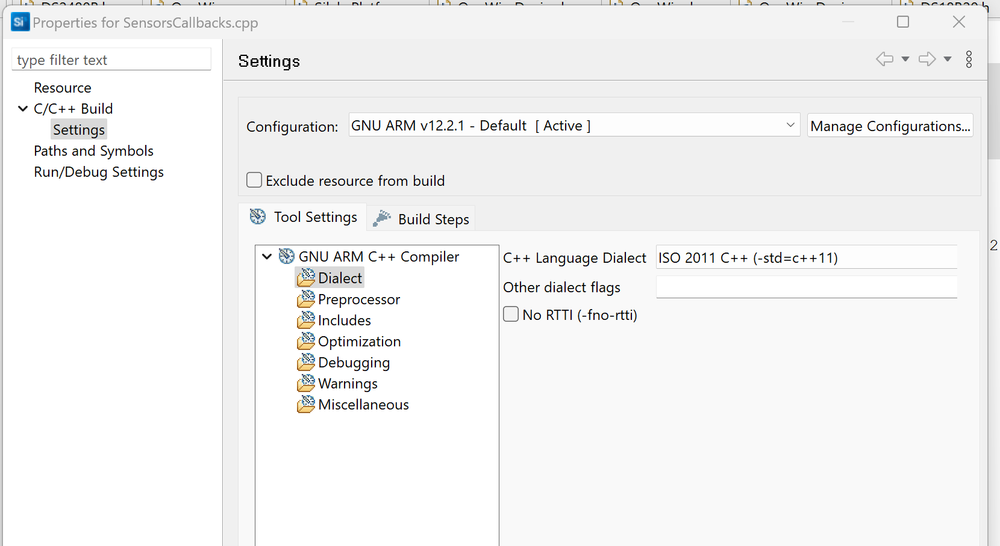
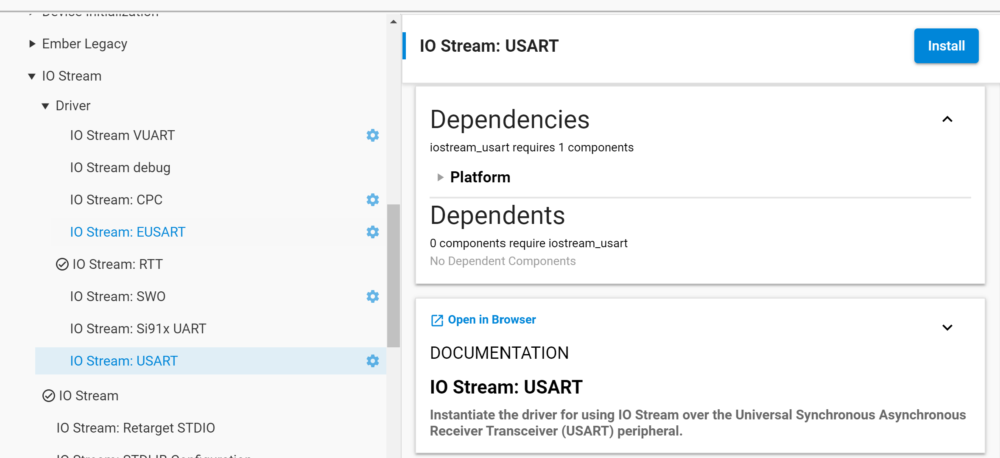
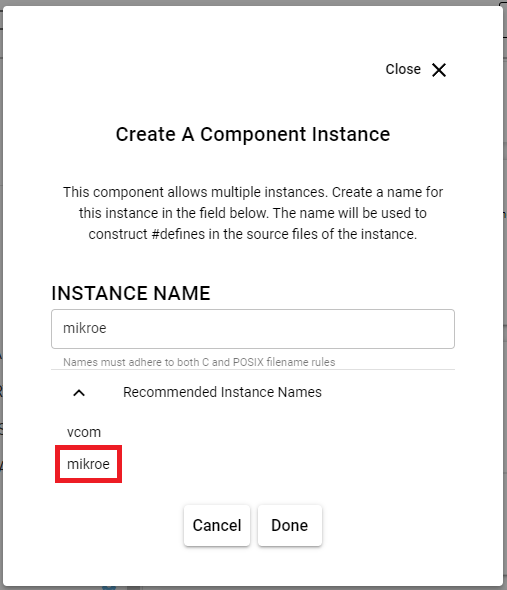
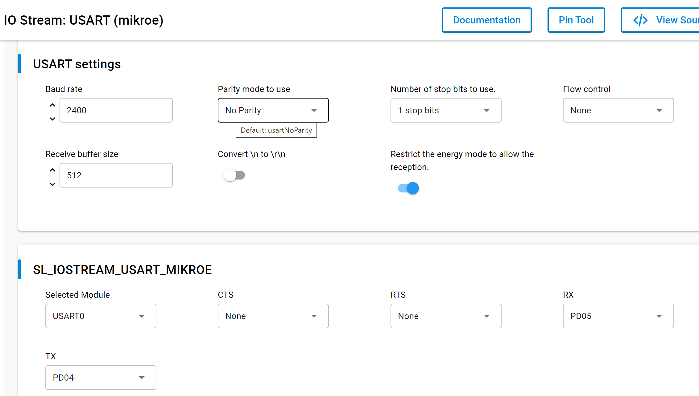

# Building a Matter Accessory Device based on Silicon Labs EFR32xG24 Explorer Kit Board (EK2703A) with a Mikro Elektronika M-BUS SLAVE CLICK.
### Author: [Olav Tollefsen](https://www.linkedin.com/in/olavtollefsen/)

## Introduction

This article shows how to create a Matter device that can read data from the HAN-port of a domestic electricity meter to read data for power usage and electricity consumption.

This article is based on Silicon Labs Gecko SDK version 4.3.2 with Silicon Labs Matter 2.2.0.





### What you will need

- A PC running Windows as the development workstation.
- Install Simplicity Studio V5 from Silicon Labs.
- Silicon Labs EFR32xG24 Explorer Kit Board (EK2703A).
- Mikro Elektronika M-BUS SLAVE CLICK

This article assumes that you have already installed Simplicity Studio V5 and the Simplicity SDK Suite v2024.6.0.

## Mount the Mikro Elektronika M-BUS SLAVE CLICK

When mounting the Mikro Elektronika M-BUS SLAVE CLICK on the Silicon Labs EFR32xG24 Explorer Kit Board make sure it's oriented correctly according to this illustration:




## Enable long paths / filenames

To avoid issues with filename length restrictions, make sure to apply settings to support longer paths / filenames.

### Windows

https://learn.microsoft.com/en-us/windows/win32/fileio/maximum-file-path-limitation?tabs=registry#enable-long-paths-in-windows-10-version-1607-and-later

### Git

```
git config --system core.longpaths true
```

## Create a new project based on the "Matter - SoC Sensor over Thread with internal Bootloader" Solution Example

Start by creating a new project in Simplicity Studio V5 by selecting the "Matter - SoC Sensor over Thread with internal Bootloader" example solution project and click "Create":



This is a good starting point as it already implements a fully functional Matter over Thread device.

## Support for newer C++ versions

By default, the project will support "-std=gnu++17". In the default project there are two settings related to the C++ language version. The first setting is the "C++ Language Dialect" setting under "Dialect" (under "GNU ARM C++ Compiler" settings).

## Turn off C++ "No RTTI" option

In order to use some C++ language features (like dynamic_cast) you may need to turn off the "No RTTI" option.



## Prepare the bootloader for Over-The-Air firmware upgrades

See this article for more details on Creating a Gecko Bootloader for Use in Matter OTA Software Update: https://docs.silabs.com/matter/2.0.0/matter-overview-guides/ota-bootloader

Open the .slcp file in your bootloader project and select "SOFTWARE COMPONENTS".

Make sure that the "GBL Compression (LZMA)" component under Platform->Bootloader->Core is installed:


Build the bootloader project, find the .s37 image file (under the Binaries folder) and flash it to your Silicon Labs Dev Kit.

## Add USUART support for the Mikro Elektronika M-BUS SLAVE CLICK

Open the .slcp file in your project and select "SOFTWARE COMPONENTS".

Locate "Services->IO Stream->Driver->IO Stream: USART", select it and click "Install"



Select the name "mikroe" and click Done.



Select the "mikroe" instance and click "Configure"



Change the Baud Rate to 2400, the Receive Buffer Size to 512 and the CTS and RTS to None.


