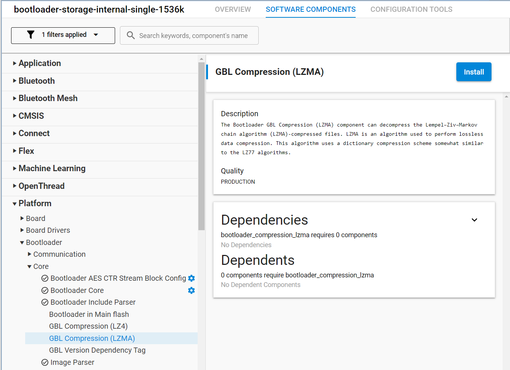

# Building a Matter Accessory Device based on Silicon Labs EFR32xG24 Explorer Kit Board (EK2703A) with a Mikro Elektronika M-BUS SLAVE CLICK.
### Author: [Olav Tollefsen](https://www.linkedin.com/in/olavtollefsen/)

## Introduction

This article shows how to create a Matter device that can read data from the HAN-port of a domestic electricity meter to read data for power usage and electricity consumption.

This article is based on Simplicity SDK Suite v2025.6.0 with Silicon Labs Matter 2.6.0 extensions (based on Matter version 1.4).


### What you will need

- A computer running Windows as the development workstation.
- Install Simplicity Studio V5 from Silicon Labs.
- Silicon Labs EFR32xG24 Explorer Kit Board (EK2703A).
- Mikro Elektronika M-BUS SLAVE CLICK

This article assumes that you have already installed Simplicity Studio V5 with Simplicity SDK Suite v2025.6.0 and Silicon Labs Matter 2.6.0.

## Mount the Mikro Elektronika M-BUS SLAVE CLICK

When mounting the Mikro Elektronika M-BUS SLAVE CLICK on the Silicon Labs EFR32xG24 Explorer Kit Board make sure it's oriented correctly according to this illustration:


## Enable long paths / filenames

To avoid issues with filename length restrictions, make sure to apply settings to support longer paths / filenames.

### Windows

https://learn.microsoft.com/en-us/windows/win32/fileio/maximum-file-path-limitation?tabs=registry#enable-long-paths-in-windows-10-version-1607-and-later

### Git

```
git config --system core.longpaths true
```

## Create a new project based on the "Matter - SoC Sensor over Thread with internal Bootloader" Solution Example

Start by creating a new project in Simplicity Studio V5 by selecting the "Matter - SoC Multi Sensor over Thread with internal Bootloader" example solution project and click "Create":


This is a good starting point as it already implements a fully functional Matter over Thread device.

## Prepare the bootloader for Over-The-Air firmware upgrades

See this article for more details on Creating a Gecko Bootloader for Use in Matter OTA Software Update: https://docs.silabs.com/matter/2.0.0/matter-overview-guides/ota-bootloader

Open the .slcp file in your bootloader project and select "SOFTWARE COMPONENTS".

Make sure that the "GBL Compression (LZMA)" component under Platform->Bootloader->Core is installed:



Build the bootloader project, find the .s37 image file (under the Binaries folder) and flash it to your Silicon Labs Dev Kit.

## Change the OpenThread stack from Minimal Thread Device (MTD) to Full Thread Device (FTD)

If you have a mains powered device, you may want to change the OpenThread stack from Minimal Thread Device (MTD) to Full Thread Device (FTD) in order for the device to participate in routing of messages.

By default the sample is configured as a Minimal Thread Device.

### Workaround for bug in Simplicity SDK Suite v2024.6.2

Due to a bug in Simplicity SDK Suite v2024.6.2 you need to perform the following steps before installing the Full Thread Device Support:

Open the .slcp file in your project and select "SOFTWARE COMPONENTS".

#### Clear the flags in the Quality settings filter

Clear all checkboxes in the Quality settings filter as shown below:


#### Remove all ICD related components

Type in "ICD" in the search box and press Enter.

Uninstall all these components:


Note! You may need to uninstall some of the lower components first due to some dependencies between them.

#### Change configuration settings for the Matter Core Components component

Type "matter core" in the search field. Expand the tree and find this component:


Click on the Configure cogweel and toggle off these settings as shown below:


#### Remove the ICD Management cluster

Open the .zap file found here:


Select Endpoint #0 in the left pane, search for "icd" in the search box and remove the ICD Management cluster by unchecking the Server checkbox.


### Install the Full Thread Device support

Open the .slcp file in your project and select "SOFTWARE COMPONENTS".

Search for "FTD", select the "Stack (FTD") component and click on "Install".


If you get the message "The Stack (FTD) you are attempting to install is conflicting with ICD Server Configuration. As a result, your component was not added.", select "Replace ICD Server Configuration with Stack (FTD)" and click OK.


If you get the message "TThe Stack (FTD) you are attempting to install is conflicting with Stack (MTD). As a result, your component was not added.", select "Replace Stack (MTD) with Stack (FTD)" and click OK.


It might be a good idea to build the projects at this time to check that there are no build errors.

## Support for newer C++ versions

By default, the project will support "-std=gnu++17". Right click on the project and select "Properties". Then expand "C/C++ Build" and select "Settings". Expand "GNU ARM C++ Compiler" and select the desired C++ Language Dialect.

## Turn off C++ "No RTTI" option

In order to use some C++ language features (like dynamic_cast) you may need to turn off the "No RTTI" option.


## Add USUART support for the Mikro Elektronika M-BUS SLAVE CLICK

Open the .slcp file in your project and select "SOFTWARE COMPONENTS".

Locate "Services->IO Stream->Driver->IO Stream: USART", select it and click "Install"


Select the name "mikroe" and click Done.


Select the "mikroe" instance and click "Configure"


Change the Baud Rate to 2400, the Receive Buffer Size to 512 and the CTS and RTS to None.

## Add Support for Matter Electrical Sensor

Open the config/common/sensor-thread-app.zap file in the ZAP editor by double-clicking on it.

By default the example project creates the following endpoints:


Delete endpoint 1 through 3.

Create a new endpoint and select "Matter Electrical Sensor" in the Device dropdown list. Click Create.


## Remove unused sensor type

When you create the sensor project it defaults to Occupancy Sensor and Temperature sensor. We will not be used the occupancy sensor functionality, so uninstall the "Occupancy Sensing Server Cluster".

Search for "Occupancy" and uninstall the "Occupancy Sensing Server Cluster" component.

Now build the project to find the references to the deleted code. Delete the references to the deleted code.

## Change the Matter Product Id

Open the 'CHIPProjectConfig.h' file located in the project include directory.

Change the CHIP_DEVICE_CONFIG_DEVICE_PRODUCT_ID as follows:

```c++
#define CHIP_DEVICE_CONFIG_DEVICE_PRODUCT_ID 0x8003
```

## Add new code for the Electricity Meter

TBD

## Build the projects in the solution

Select the solution in Simplicity Studio and select "Build". This will build the bootloader and the application project.

## Change the Matter Vendor Name / Product Name

Open the .slcp file in your project and select "CONFIGURATION TOOLS".

Find "Matter Provisioning" in the list of tools and select "Open".

Select the "MATTER DEVICE PROVISIONING" tab.

Scroll down to the "OPTIONAL" section and enter values into the "Vendor Name" and "Product Name" input fields.

Select "Provision Device"

## Erase the device

Open the bootloader project and expand the Binaries, select the .s37 file and select "Flash to Device".

Select "Unlock Debug Access" and then "Erase".


